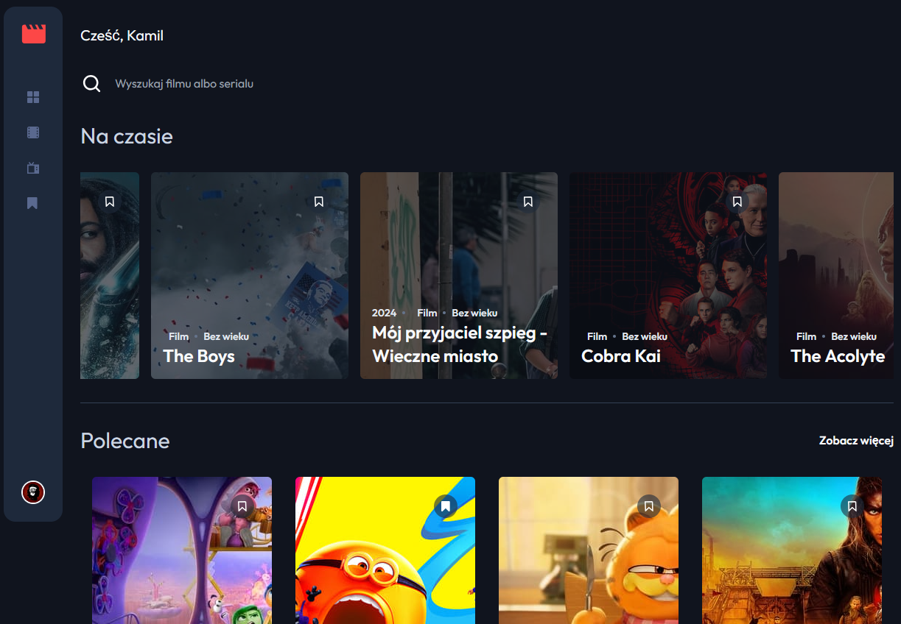
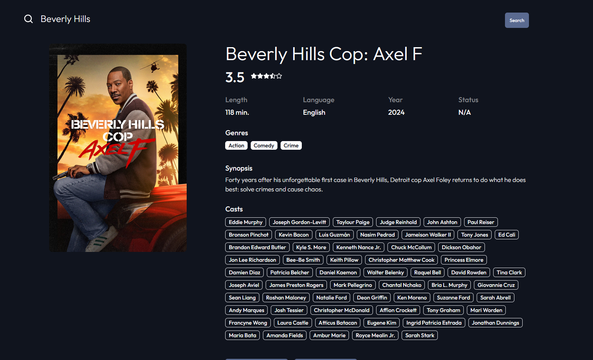

<h3 align="center">🎬 JustMovie - Your Ultimate Movie App</h3>

<p align="center">
  Browse. Watch. Bookmark. All in one beautiful app.  
  <br />
  <a href="https://just-movie-k1q7tgjwi-ktcotzs-projects.vercel.app"><strong>Live Demo »</strong></a>
</p>

---

## 🌟 Project Overview

**JustMovie** is a modern and fully responsive movie streaming app built with React, TailwindCSS, and Supabase.  
A real rival to Netflix – but 100% free.

- Browse your favorite movies and series
- Save them with bookmarks
- Manage your profile with custom avatars and settings
- All built from scratch with scalable architecture

---

## 🖼️ Preview

| Dashboard Page                  | Movie Details              |
|---------------------------|----------------------------|
|  |  |

---

## 💡 Why I Built This

As an aspiring frontend developer, I wanted to build something real-world and user-focused – not just another to-do app.  
This project helped me:

- Connect to external APIs (TMDB)
- Implement user authentication and storage (Supabase)
- Build a clean UI using TailwindCSS
- Work with forms, validation, pagination, uploads, and multi-language support

All features were planned, designed, and developed by me.

---

## 🚀 Features

- 🎞️ Browse movies by category, genre, and individual details
- 🔖 Bookmark system per user
- 👤 Authentication, profile settings & avatars
- 🌐 Multi-language support (i18n)
- ⚙️ Responsive design + mobile support
- 📊 CRUD operations with database (Supabase)
- 📦 Performance: 100/100/100/100 Lighthouse Score
- 🧪 Form validation (Zod + React Hook Form)
- 🔥 Fully typed with TypeScript

---

## 🧰 Tech Stack

| Tech                              | Role               |
|-----------------------------------|--------------------|
| React, TypeScript                 | App & logic        |
| Vite                              | Fast build tool    |
| TailwindCSS                       | Styling            |
| Supabase                          | Backend-as-a-Service |
| React Router                      | Routing            |
| React Query                       | Data fetching      |
| React Hook Form + Zod             | Forms + validation |
| i18n                              | Translations       |
| React Dropzone, Hot Toast, Tooltip | UI enhancements    |
| Context API                       | State management   |

---

## 📦 Installation

```bash
# 1. Install dependencies
npm install

# 2. Create a .env file and add:
VITE_SUPABASE_KEY=your_supabase_app_key
VITE_TMDB_API_KEY=your_tmdb_api_key

# 3. Run the dev server
npm run dev

# 4. Open the localhost link in your browser

```

## 👨‍💻 Developer Info
- 🐙 GitHub: https://www.github.com/ktcotz
- 💼 LinkedIn: https://www.linkedin.com/in/naskret-kamil/
- 🌐 Portfolio: https://kamil-me.vercel.app/
- 📫 Email: naskret.kamil@gmail.com
